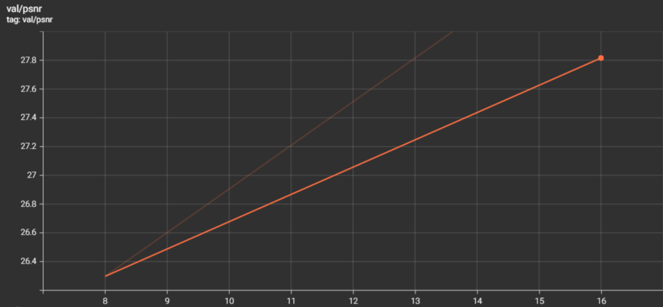
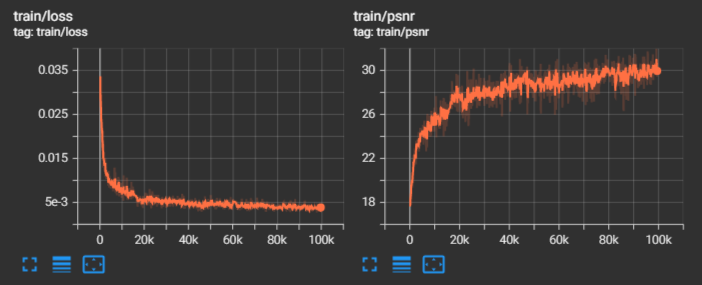
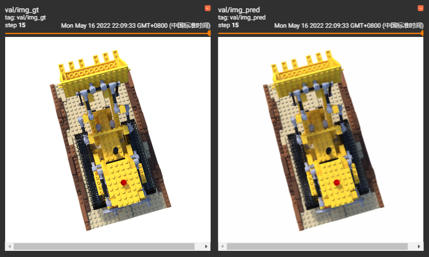
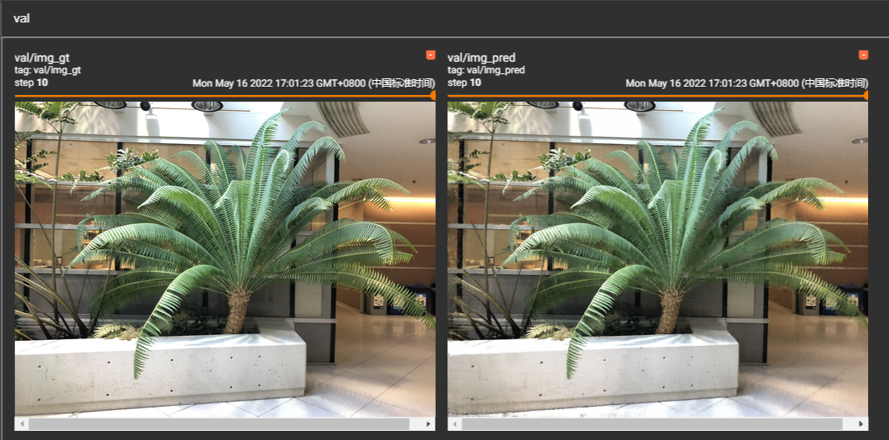

# NeRF_impl
Neural Radiance Fields by Friday

# 目前进度
- [x] LLFF Dataset测试：通过
- [x] Blender Dataset测试：通过
- [x] 更新tensorboard显示 (可对比多次训练)
- [x] 更新了自定义损失率调节器，进一步提升渲染精度
- [x] 替换base-MLP为sine-MLP => Siren-NeRF（可以参考我的Siren-NeRFMM），收敛效果显著！

# 支持的测试方法
- 测试Postion Encoding

1. Gaussian Encoding
2. Adaptive Positional Encoding
3. Wavelet Positional Encoding

- 测试volume激活函数

1. Sigma activation：Softplus
2. Color activation: Lapician

- 测试MLP激活函数

1. **sine-based-MLP：Perform GOOD o(￣▽￣)ｄ！**

# 说明
我拆分了NeRF原本繁重复杂的代码，对新手入门NeRF更加友好

注意：所有配置都在config文件夹下，运行之前一定要检测数据集目录和自己的目录是否匹配！

# 如何运行程序
```python
python train_nerf.py --config_dir <config.yaml> --exp_ver <exp version name>
```

# 优点
在程序运行过程中，可以开启tensorboard观测训练结果（下面是lego训练过程）

| 训练                                                 | 测试                                                   |
| ---------------------------------------------------- | ------------------------------------------------------ |
|  |  |

# 训练结果
可以在**temp**文件夹下找到所有训练保存结果，包括：

- exp：保存tensorboard记录与训练模型
- img：验证图像随着训练逐渐被渲染
- video：目前应用在其他项目中，nerf暂时不需要

## Comparison

- NeRF(MES Loss with LR_schdule，Dataset：fern，NDC空间)

| Epoch=50  | 训练 | 验证 | NeRF论文 |
|  ----  | ----  | ----  | ----  |
| Loss  | 4.98e-3 | None | None  |
| PSNR  | 28.79(for 100k iters) | 25.83(for 100k iters) | 25.17(for 100k iters)  |

* NeRF(MES Loss with LR_schdule，Dataset：lego，NDC空间)

我实在是不想跑了233，效果肯定达到了，租服务器真的心疼/(ㄒoㄒ)/~~

| Epoch=50  | 训练 | 验证 | NeRF论文 |
|  ----  | ----  | ----  | ----  |
| Loss  | 4.98e-3 | None | None  |
| PSNR  | 31.46(for 10k iters) | 28.74(for 10k iters) | 32.54(for 100k iters)  |

* 一组对比实验（MES Loss with LR_schdule，Dataset：fern，use spherical pose，真实空间）

| Model      | MSE Loss                  | Render PSNR            |
| ---------- | ------------------------- | ---------------------- |
| Siren-NeRF | 0.01019（8k iterations）  | 23.3（8k iterations）  |
| NeRF       | 0.01108（15k iterations） | 22.5（15k iterations） |


## Render Image

| lego                                                    | fern                                                    |
| ------------------------------------------------------- | ------------------------------------------------------- |
|  |  |


# 注意

如果您使用了此版本开源代码，请标注出处，如果能给本项目点个赞就更好啦！
